# AIoT Github

## Lecture 15: IoT Flask Web (deploy to heroku)

### step 1 : Clone this github

### step 2 : install some package

gunicorn 只適用UNIX系統
且本作業好像也用不到?

```python
Flask==2.0.1 
Jinja2==3.0.1 
psycopg2 
sklearn 
pandas  
numpy 
```

### step 3: add an heroku postgredb

* register heroku account
* go to dashboard
* new an app
* go to resource and add-on an Heroku postgredb

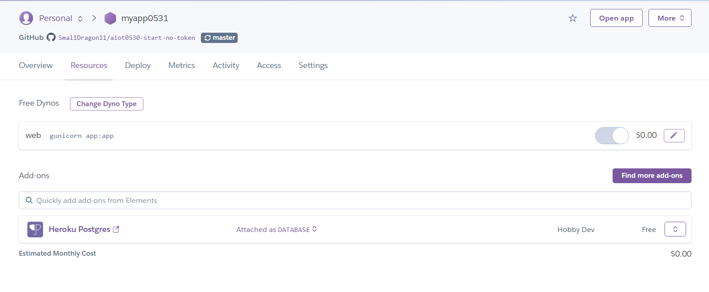

### step 4: login to heroku pstgredb using HeidiSQL

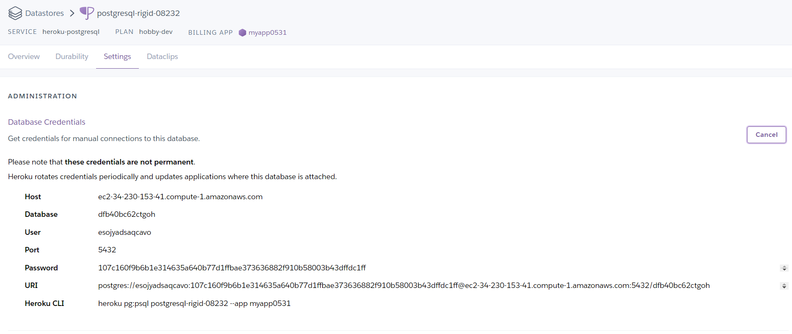

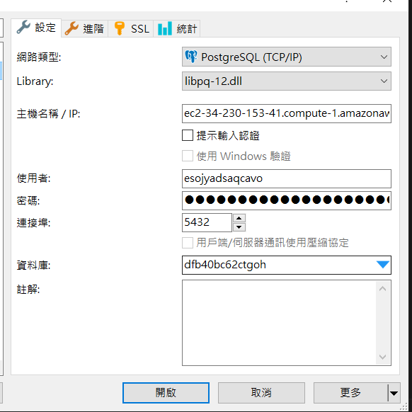


### step 5: import postgredb (in db/postgre.sql)

在public資料庫匯入postgre.sql表格


### step 6: setting db in app.py

```sql
myserver ="<fill-in-Heroku-Postgredb-DB-sever>"
myuser="<fill-in-Heroku-Postgredb-DB-user>"
mypassword="<fill-in-Heroku-Postgredb-DB-pwd>"
mydb="<fill-in-Heroku-Postgredb-DB-db>"

```

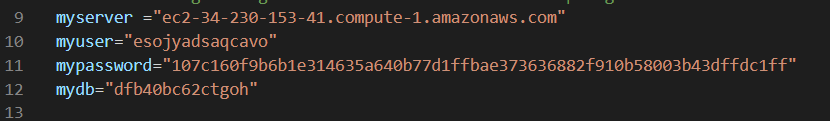


### step 7: testing locally by running python app.py

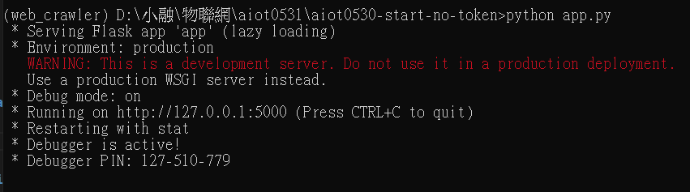

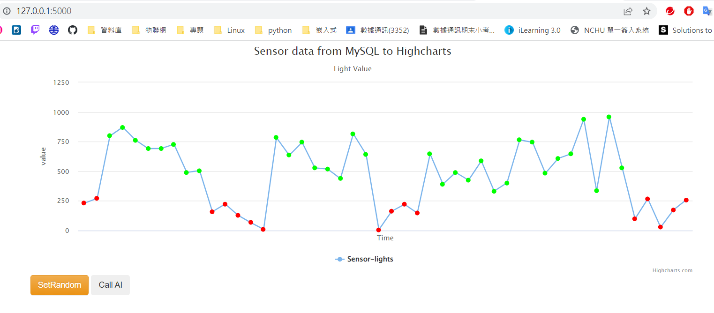

### step 8: deploy to github

git push to

link: https://github.com/SmallDragon11/aiot0530-start-no-token


### step 9: Heroku deploy from github

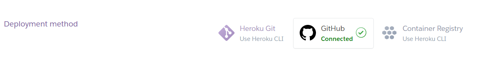

### step 10: Complete

mylink: https://myapp0531.herokuapp.com/

### setRandom heroku:
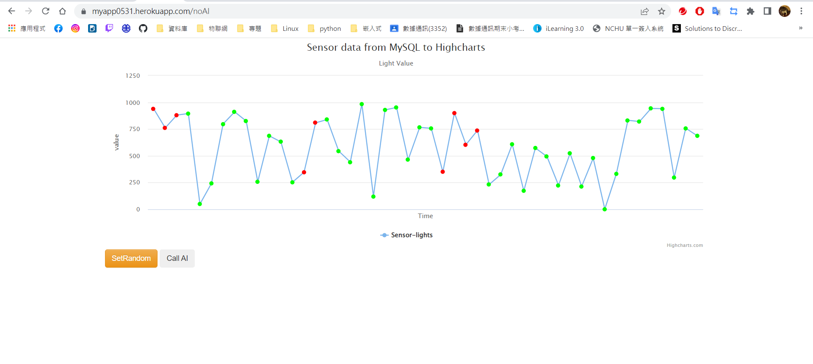


### callAI heroku:
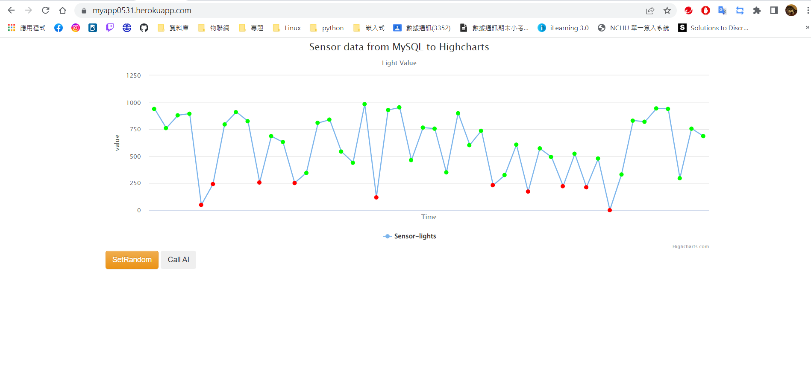


### setRandom Local:
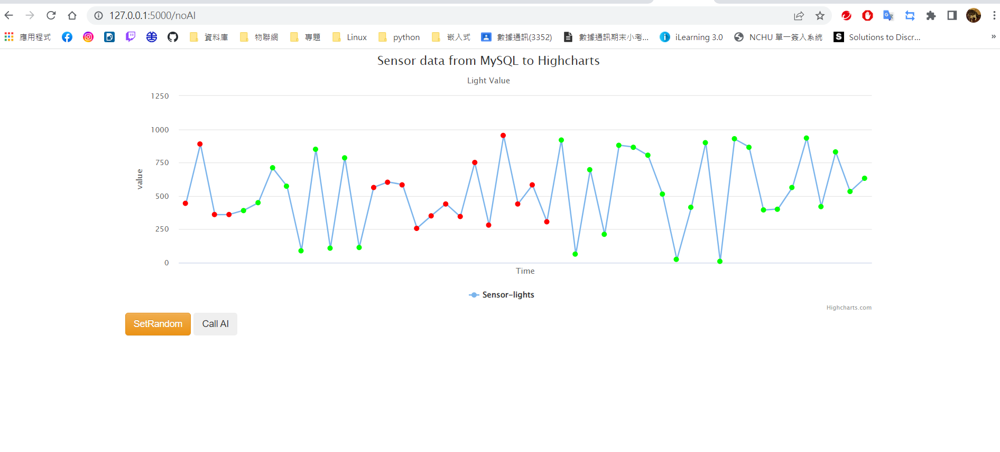


### callAI Local:
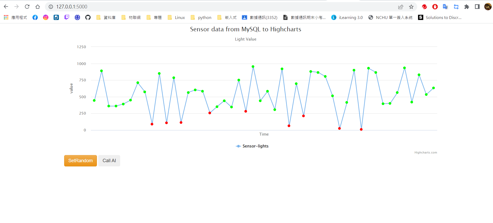